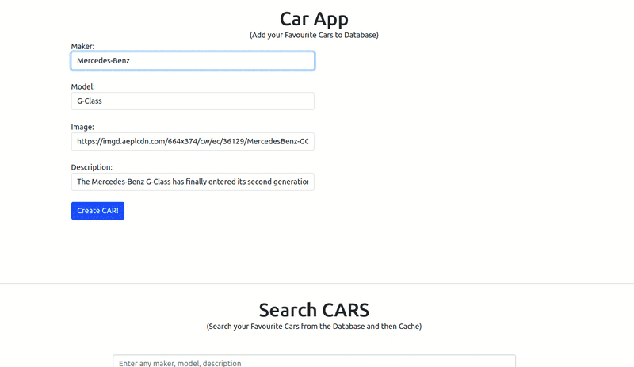

## Redis Car App

<div align="center">


 &emsp;  &emsp; 

</div>

<hr/>

#### View the App here: https://redis-car-app.vercel.app

### Features:

    * Add a new car to database with make, model, Image, and description
    * View the Added car using search option
    * The car is listed out from database and will be stored in the cache
    * Next time the user will be able to view the car from cache.

### Demo:

<div style="border: 5px solid black; border-radius: 8px">



</div>

### About the App

- This App is developed to demonstrate the use of Redis Cache, it has many other use cases to take advantage of its blazing-fast **in-memory database.**

- Redis uses data to store a as a key-value pair in the system memory. This database is more used as a cache to store frequently accessed data in memory so that apps can respons more faster to users.

> Making use of Caching? <br/> # Caching is the process of storing copies of data in caches _(“short-term computer memory")_ allowing apps to access and retrieve data faster. <br/># The goal of caching is speeding up data access operations better than a **database**, a remote server could allow. Really helpful rather expensive (in time) operations.

- The process of caching in this app works like:-
  - When we receive a user request to a route that has caching enabled, we first check if the requested data is already stored in the cache.
  - If yes, we can quickly retrieve data from Redis cache and send the response.
  - However, if the data is not stored in the cache, which we call a **cache miss**, then we first retrieve the data from the database and send it to the client. Then we make sure to store the retrieved data in the cache so that the next time when the same request is received, we simply send the cached data to the user faster, achieving high availability of data.

<hr/>

The project is a simple search app created to show the Redis Database performance developed using:-

- NextJS
- RedisDB => _(RedisSearch, RedisJSON as its modules)_
- Bootstrap.

### Getting Started:

This is a [Next.js](https://nextjs.org/) project bootstrapped with `create-next-app`.

- Install the project dependencies using `npm install`

#### Get your Online Redis Database server instance:-

```
- Go to https://app.redislabs.com/#/login and create an account.

- Then, create a Subscription with any name (For ex: redisdb-proj).
	For free subscription you will get
	- Max 30MB of 1 database usage.
	- Only 30 connections per day.

- Then subscription is created and Go to Databases and create one with following configurations:-
    - Name: redis-car-app
    - Protocol: Redis
    - Under Modules: Select "RedisSearch" and "RedisJSON"
    - Remaining leave it default.
- Then click on "Activate Database" at the top of page.

- Copy it's "Public endpoint" and "Default Password" under the configurations tab.

```

- Now insert those in the `.env.local` file like this:-

`REDIS_URL = redis://default:<PASSWORD>@<PUBLIC_END_POINT>`

- Then, Run the development server: `npm run dev`

- Open [http://localhost:3000](http://localhost:3000) with your browser to see the app running, There you GO!

### API Routes used in this project:-

> Any file inside the folder `pages/api` is mapped to `/api/*` and will be treated as an API endpoint instead of a page.

- In case running your project locally, you need to use the following endpoint:

  - `http://localhost:3000/api/createIndex` - in order to create the indexes for keys, so then only the data can be retreived.

- API routes can be accessed on [http://localhost:3000/api/hello](http://localhost:3000/api/hello). This endpoint can be edited in `pages/api/hello.js`.

- Routes created for this app are:
  - http://localhost:3000/api/createIndex
  - http://localhost:3000/api/cars
  - http://localhost:3000/api/search

#### Contributions:

This is a beginner friendly project for learning RedisDB along with NextJS. Feel free to fork and make your own project.
<br>
You can check out [this GitHub repository anytime](https://github.com/Sudhee-bsp/Redis-Car-App/) - your feedback and contributions are welcome!
